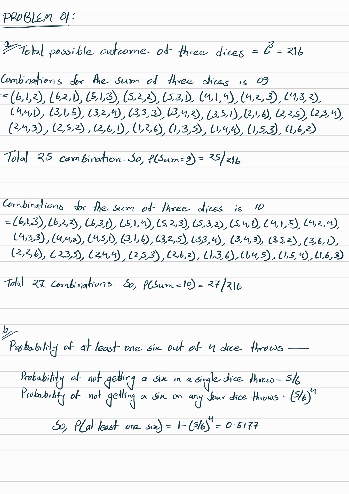
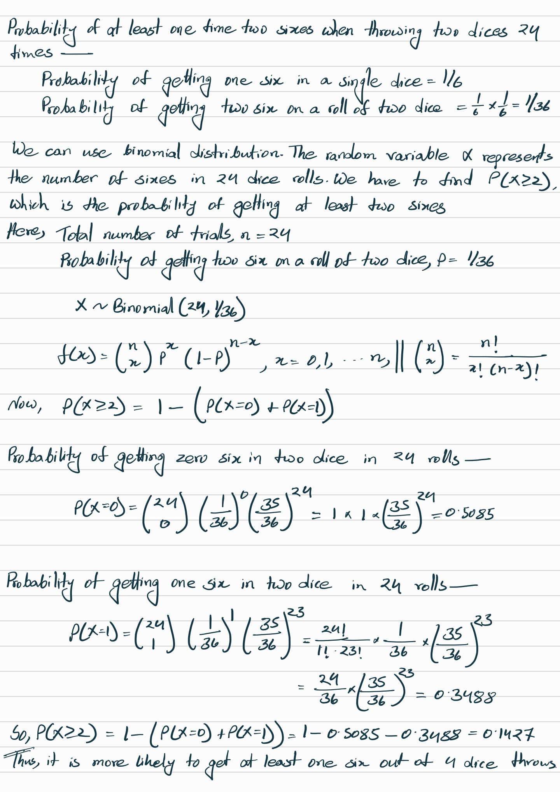
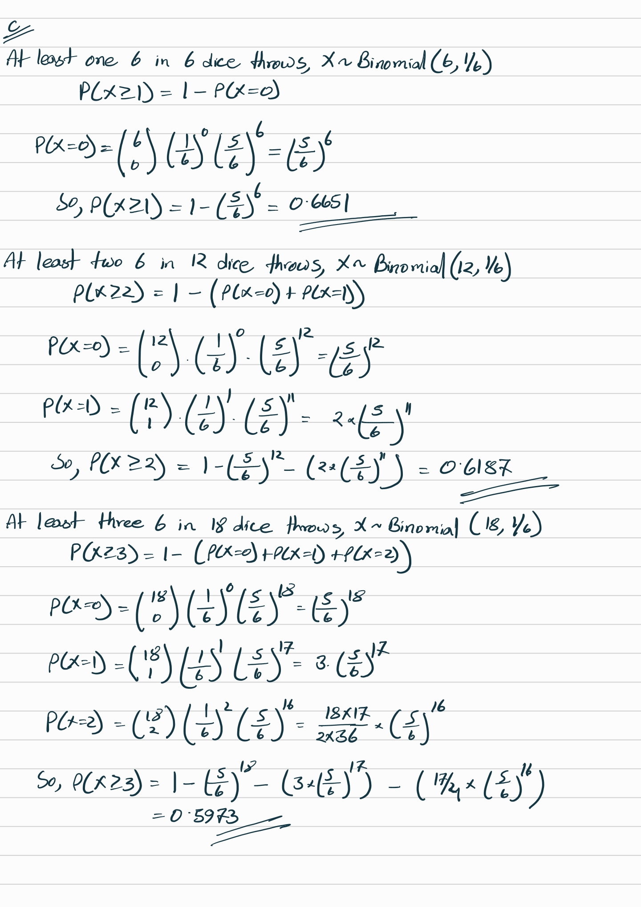
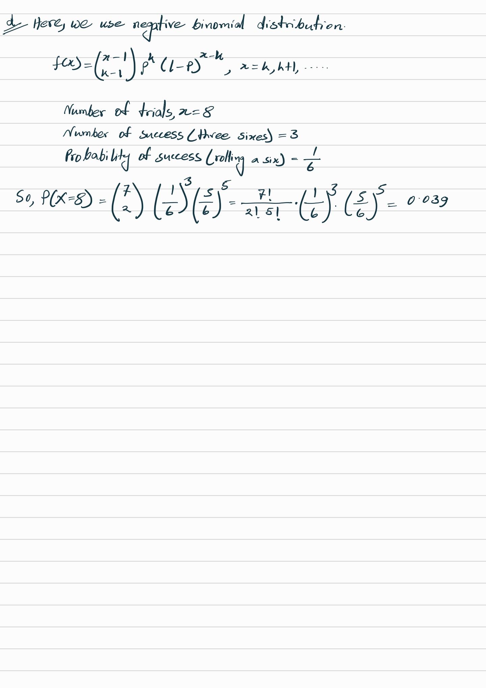
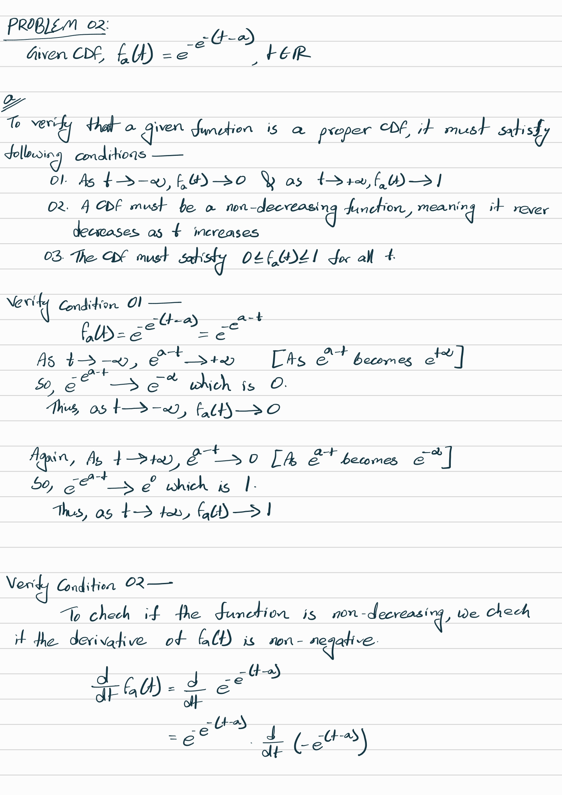
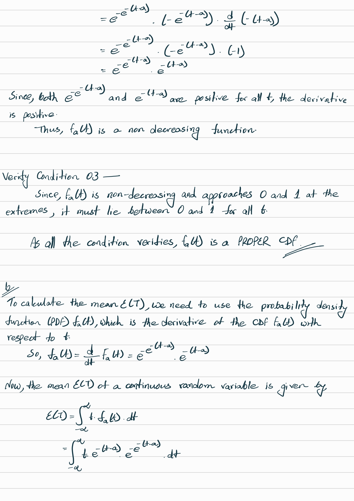
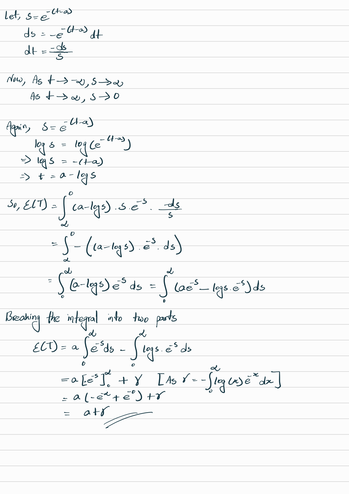
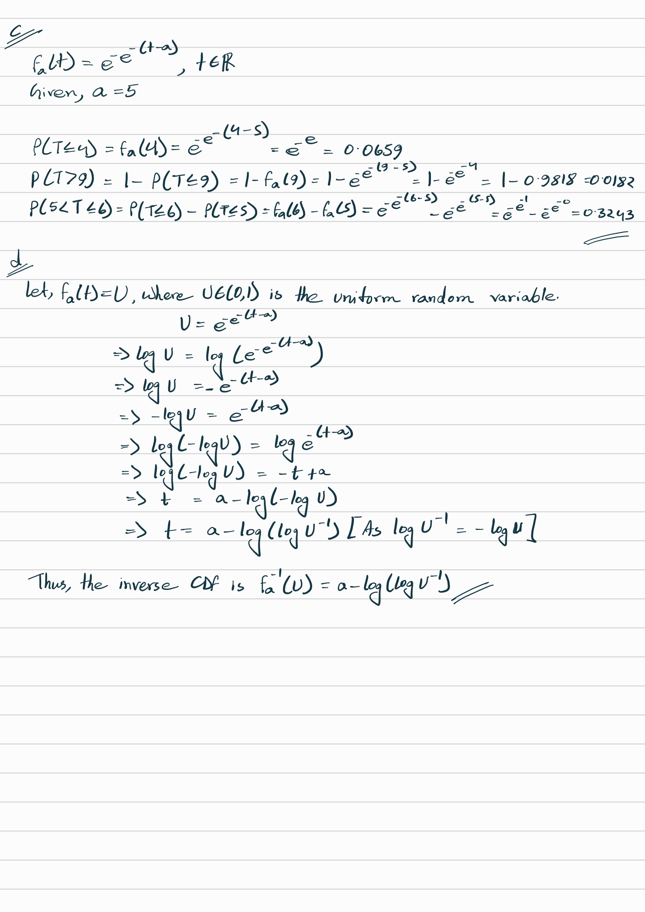
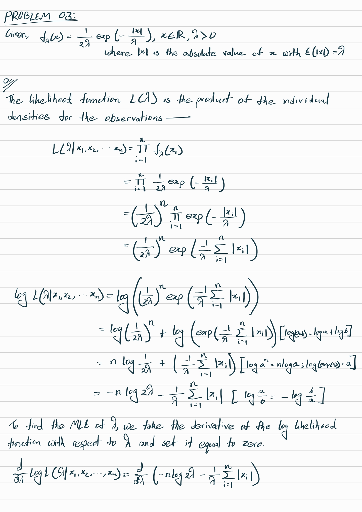
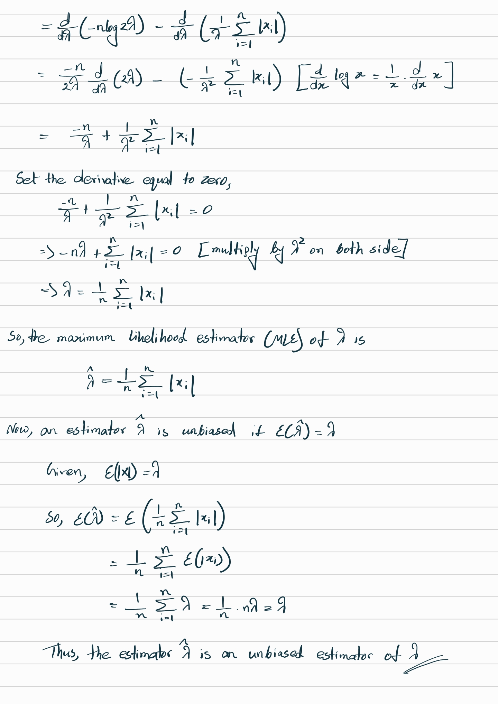

```{r setup, include=FALSE}
rm(list=ls()) # Clear the workspace to start fresh
knitr::opts_chunk$set(echo = TRUE)
```
### Problem 01 || Theory

\newpage

\newpage

\newpage

\newpage

### Problem 01 (a) || R
```{r}
n_sim <- 10000 # 10000 Simulations
set.seed(123)  # For reproducibility

# Simulate 10000 trials of rolling 3 dice and summing their results
three_dice_rolls <- 
  replicate(n_sim, sum(sample(1:6, 3, replace = TRUE)))

# Calculate the probabilities
prob_sum_9 <- mean(three_dice_rolls == 9)
prob_sum_10 <- mean(three_dice_rolls == 10)

# Output
cat("Probability of Sum being 9: ", prob_sum_9, 
    "& Sum being 10: ", prob_sum_10, "\n")
```

### Problem 01 (b) || R
```{r}
# At least one six in 4 rolls
one_six_in_4_rolls <- 
  replicate(n_sim, any(sample(1:6, 4, replace = TRUE) == 6))
prob_one_six_in_4_rolls <- mean(one_six_in_4_rolls)

# At least two sixes in 24 trials of 2 dice
two_sixes_in_24_trials <- 
  replicate(n_sim, sum(replicate(24, sum(sample(1:6, 2, replace = TRUE)) == 12)) >= 2)
prob_two_sixes_in_24_trials <- mean(two_sixes_in_24_trials)

# Output
cat("Probability of at least one six in 4 dice rolls: ", 
    prob_one_six_in_4_rolls, "\n")
cat("Probability of at least two sixes in 24 dice rolls: ", 
    prob_two_sixes_in_24_trials, "\n")
```

### Problem 01 (c) || R
```{r}
# At least one six in 6 rolls
at_least_one_six_in_6_rolls <- 
  replicate(n_sim, sum(sample(1:6, 6, replace = TRUE) == 6) >= 1)
prob_at_least_one_six <- mean(at_least_one_six_in_6_rolls)

# At least two sixes in 12 rolls
at_least_two_sixes_in_12_rolls <- 
  replicate(n_sim, sum(sample(1:6, 12, replace = TRUE) == 6) >= 2)
prob_at_least_two_sixes <- mean(at_least_two_sixes_in_12_rolls)

# At least three sixes in 18 rolls
at_least_three_sixes_in_18_rolls <- 
  replicate(n_sim, sum(sample(1:6, 18, replace = TRUE) == 6) >= 3)
prob_at_least_three_sixes <- mean(at_least_three_sixes_in_18_rolls)

# Output
cat("Probability of at least one six in 6 rolls: ", 
    prob_at_least_one_six, "\n")
cat("Probability of at least two sixes in 12 rolls: ", 
    prob_at_least_two_sixes, "\n") 
cat("Probability of at least three sixes in 18 rolls: ", 
    prob_at_least_three_sixes, "\n")
```

### Problem 01 (d) || R
```{r}
# Simulate exactly 3 sixes in 8 rolls
three_sixes_in_8_rolls <- replicate(n_sim, {
  rolls <- sample(1:6, 8, replace = TRUE)
  sum(rolls == 6) == 3
})

prob_three_sixes_in_8_rolls <- mean(three_sixes_in_8_rolls)

# Output
cat("Probability of exactly 3 sixes in 8 rolls: ", 
    prob_three_sixes_in_8_rolls, "\n")
```
\newpage

### Problem 02 || Theory

\newpage

\newpage

\newpage

\newpage

### Problem 02 (e) || R
```{r}
# Load necessary libraries
library(ggplot2)

# Define the inverse CDF function (using inverse transform sampling)
inverse_cdf <- function(n, a) {
  # Generate n uniform random numbers between 0 and 1
  U <- runif(n)
  # Use the inverse of the CDF to generate random numbers from the distribution
  T <- a - log(-log(U))
  return(T)
}

# Define the theoretical PDF function
theoretical_pdf <- function(t, a) {
  return(exp(-(t - a)) * exp(-exp(-(t - a))))
}

# Set parameters
n <- 1000
a <- 5

# Generate random numbers using the inverse CDF method
random_numbers <- inverse_cdf(n, a)

# Create a data frame for plotting
data <- data.frame(x = random_numbers)

# Generate theoretical PDF values for comparison
t_values <- seq(min(random_numbers), max(random_numbers), length.out = 1000)
pdf_values <- theoretical_pdf(t_values, a)

# Plot histogram, KDE, and theoretical PDF
ggplot(data, aes(x)) +
  # Histogram with density scaling using after_stat(density)
  geom_histogram(aes(y = after_stat(density)), 
                 bins = 30, fill = "lightblue", color = "black", alpha = 0.7) +
  # KDE line using linewidth instead of size
  geom_density(color = "red", linewidth = 1) +
  # Theoretical PDF line using linewidth instead of size
  geom_line(aes(x = t_values, y = pdf_values), 
            color = "blue", linetype = "dashed", linewidth = 1) +
  ggtitle(paste("Histogram, KDE, and Theoretical PDF of", 
                n, "random numbers for a =", a)) +
  xlab("Random Numbers") +
  ylab("Density") +
  theme_minimal()
```

### Problem 02 (f) || R
```{r}
# Set parameters
gamma <- 0.5772  # Euler's constant

# Calculate the sample mean from the generated random numbers
sample_mean <- mean(random_numbers)

# Calculate the theoretical mean E(T) = a + gamma
theoretical_mean <- a + gamma

# Output
cat("Sample Mean: ", sample_mean, "& Theoretical Mean: ", theoretical_mean, "\n")

# Calculate and display the difference between the sample mean and the theoretical mean
difference <- abs(sample_mean - theoretical_mean)
cat("Difference between Sample Mean and Theoretical Mean: ", difference, "\n")
```

### Problem 02 (g) || R
```{r}
# Calculate the sample variance
sample_variance <- var(random_numbers)
sample_sd <- sqrt(sample_variance)

# Define the desired precision
desired_precision <- 0.01

# Calculate the number of samples needed for the desired precision
required_n <- (sample_sd / desired_precision)^2

# Output
cat("Sample Variance: ", sample_variance, 
    "& Sample Standard Deviation: ", sample_sd, "\n")
cat("Required Sample Size to Achieve Precision of 0.01: ", 
    ceiling(required_n), "\n")
```

### Problem 02 (h) || R
```{r}
# Define the theoretical CDF function
theoretical_cdf <- function(t, a) {
  return(exp(-exp(-(t - a))))
}

# Calculate the ECDF using the random numbers
ecdf_func <- ecdf(random_numbers)

# Generate theoretical CDF values for comparison
t_values <- seq(min(random_numbers), max(random_numbers), length.out = 1000)
cdf_values <- theoretical_cdf(t_values, a)

# Plot the theoretical CDF and the ECDF
ggplot() +
  # Plot the theoretical CDF
  geom_line(aes(x = t_values, y = cdf_values), 
            color = "blue", linewidth = 1, linetype = "dashed", show.legend = TRUE) +
  # Plot the ECDF
  stat_ecdf(aes(x = random_numbers), 
            color = "red", linewidth = 1, show.legend = TRUE) +
  ggtitle("Theoretical CDF vs Empirical CDF (ECDF)") +
  xlab("t") +
  ylab("CDF") +
  theme_minimal() +
  labs(color = "") +
  scale_color_manual(values = c("Theoretical CDF" = "blue", "ECDF" = "red")) +
  theme(legend.position = "right")

# Comments on Finding
# The theoretical CDF is the exact function, based on the formula for Fa(t), plotted as 
# a smooth curve. And The ECDF is based on the 1000 simulated observations and is
# represented as a step function.

# The empirical CDF closely follow the theoretical CDF. Any small deviations between the
# two curves are due to randomness in the sample. As the sample size increases, the
# empirical CDF will converge to the theoretical CDF.
```
\newpage

### Problem 03 || Theory

\newpage

\newpage

### Problem 03 (b) || R
```{r}
# Sample data
x <- c(1.3, -0.6, 0.2, 0.4, -0.8)

# Calculate MLE for lambda
lambda_hat <- mean(abs(x))

# Output
cat("MLE: ", lambda_hat, "\n")
```

### Problem 03 (c) || R
```{r}
# Define the density function for f_lambda(x)
f_lambda <- function(x, lambda) {
  (1 / (2 * lambda)) * exp(-abs(x) / lambda)
}

# Set lambda = 0.6
lambda <- 0.6

# Generate x values from -5 to 5
x_values <- seq(-5, 5, length.out = 1000)

# Compute f_lambda(x) for the x values
y_values <- f_lambda(x_values, lambda)

# Plot the density function
plot(x_values, y_values, type = "l", col = "blue", lwd = 2,
     xlab = "x", ylab = expression(f[lambda](x)),
     main = expression(paste("Density function ", 
                             f[lambda](x), " with ", lambda, "= 0.6")))
grid()
```

### Problem 03 (d) || R
```{r}
# Define the target density function f_lambda(x)
f_lambda <- function(x, lambda) {
  (1 / (2 * lambda)) * exp(-abs(x) / lambda)
}

# Proposal distribution g(x) is uniform(-5, 5), with density 1/10
g <- function(x) {
  if (x >= -5 && x <= 5) {
    return(1 / 10)
  } else {
    return(0)
  }
}

# Accept-reject sampling function
accept_reject <- function(n, lambda) {
  samples <- numeric(n)  # Vector to store the samples
  count <- 0             # Counter for accepted samples
  M <- max(sapply
           (seq(-5, 5, length.out = 1000), function(x) f_lambda(x, lambda) / g(x)))  
  
  while (count < n) {
    # Generate a candidate from the proposal distribution g(x)
    x_candidate <- runif(1, -5, 5)
    
    # Generate a uniform random number for acceptance check
    u <- runif(1)
    
    # Check acceptance condition
    if (u < f_lambda(x_candidate, lambda) / (M * g(x_candidate))) {
      samples[count + 1] <- x_candidate
      count <- count + 1
    }
  }
  
  return(samples)
}

# Set lambda = 0.6 and generate n = 500 random numbers
lambda <- 0.6
n <- 500
random_samples <- accept_reject(n, lambda)

# Plot the histogram and KDE of the generated samples
hist(random_samples, prob = TRUE, breaks = 30, main = "Histogram of Generated Samples",
     xlab = "x", col = "lightblue", border = "black")

# Add the true density function to the plot
curve(f_lambda(x, lambda), add = TRUE, col = "red", lwd = 2)
```

### Problem 03 (e) || R
```{r}
# Load necessary libraries
library(MASS)  # For bandwidth selection

# Generate 500 random samples using accept-reject method
lambda <- 0.6
n <- 500
random_samples <- accept_reject(n, lambda)

# Plot Histogram using different bin-width rules
hist_sturges <- hist(random_samples, breaks = "Sturges", plot = FALSE)
hist_scott <- hist(random_samples, breaks = "Scott", plot = FALSE)
hist_fd <- hist(random_samples, breaks = "FD", plot = FALSE)

# Plot histograms with different bin-width rules
par(mfrow = c(1, 3))  # Plot side by side
hist(random_samples, breaks = "Sturges", 
     main = "Sturges' Formula", xlab = "x", col = "lightblue", border = "black")
hist(random_samples, breaks = "Scott", 
     main = "Scott's Formula", xlab = "x", col = "lightblue", border = "black")
hist(random_samples, breaks = "FD", 
     main = "Freedman-Diaconis", xlab = "x", col = "lightblue", border = "black")
par(mfrow = c(1, 1))  # Reset to single plot

# Calculate and print selected bin-width for each rule
cat("Sturges' bin-width:", diff(hist_sturges$breaks)[1], 
    "|| Scott's bin-width:", diff(hist_scott$breaks)[1], 
    "|| Freedman-Diaconis bin-width:", diff(hist_fd$breaks)[1], "\n")

# Comments on Findings
# Sturges' formula gives a broad, smooth representation but lacks detail. 
# Scott's formula provides a good middle-ground between smoothness and detail.
# Freedman-Diaconis is the most sensitive and provides the most detailed view 
# of the data, but it may overfit in some cases.

# KDE with different bandwidth selection methods
kde_silverman <- density(random_samples, bw = "nrd0")  # Silverman's Rule of Thumb
kde_ucv <- density(random_samples, bw = "ucv")  # Unbiased Cross Validation
kde_bcv <- density(random_samples, bw = "bcv")  # Biased Cross Validation
kde_sj <- density(random_samples, bw = "SJ")  # Sheather & Jones

# Plot each KDE separately in side-by-side plots
par(mfrow = c(1, 4))  # Set up the plotting area for 4 side-by-side plots

# Silverman's Rule of Thumb
plot(kde_silverman, main = "Silverman's Rule", col = "blue", lwd = 2,
     xlab = "x", ylab = "Density", ylim = c(0, max(kde_silverman$y)))

# Unbiased Cross Validation (UCV)
plot(kde_ucv, main = "Unbiased CV", col = "red", lwd = 2,
     xlab = "x", ylab = "Density", ylim = c(0, max(kde_ucv$y)))

# Biased Cross Validation (BCV)
plot(kde_bcv, main = "Biased CV", col = "green", lwd = 2,
     xlab = "x", ylab = "Density", ylim = c(0, max(kde_bcv$y)))

# Sheather & Jones (SJ) Method
plot(kde_sj, main = "Sheather & Jones", col = "purple", lwd = 2,
     xlab = "x", ylab = "Density", ylim = c(0, max(kde_sj$y)))

# Reset the plotting layout
par(mfrow = c(1, 1))

# Plot KDE with different bandwidth rules
plot(kde_silverman, main = "Kernel Density Estimation", col = "blue", lwd = 2,
     xlab = "x", ylab = "Density", ylim = c(0, max(kde_silverman$y, kde_ucv$y, 
                                                   kde_bcv$y, kde_sj$y)))
lines(kde_ucv, col = "red", lwd = 2)
lines(kde_bcv, col = "green", lwd = 2)
lines(kde_sj, col = "purple", lwd = 2)
legend("topright", legend = c("Silverman", "UCV", "BCV", "SJ"),
       col = c("blue", "red", "green", "purple"), lwd = 2)

# Print bandwidths for different KDE methods
cat("Silverman's bandwidth:", kde_silverman$bw, "\n")
cat("Unbiased Cross Validation bandwidth:", kde_ucv$bw, "\n")
cat("Biased Cross Validation bandwidth:", kde_bcv$bw, "\n")
cat("Sheather & Jones bandwidth:", kde_sj$bw, "\n")
```

### Problem 03 (f) || R
```{r}
# Define the target CDF F_lambda(x)
F_lambda <- function(x, lambda) {
  0.5 + 0.5 * sign(x) * (1 - exp(-abs(x) / lambda))
}

# Generate random samples using accept-reject method
lambda <- 0.6
n <- 500
random_samples <- accept_reject(n, lambda)

# Generate a sequence of x values to compute the theoretical CDF
x_values <- seq(-5, 5, length.out = 1000)
cdf_values <- F_lambda(x_values, lambda)

# Plot the theoretical CDF using ggplot2
plot(x_values, cdf_values, type = "l", col = "red", lwd = 2,
     main = "Theoretical CDF vs ECDF",
     xlab = "x", ylab = "CDF", ylim = c(0, 1))

# Add the ECDF based on simulated data
ecdf_plot <- ecdf(random_samples)
lines(ecdf_plot, col = "blue", lwd = 2)

# Add legend to differentiate the CDF and ECDF
legend("bottomright", legend = c("Theoretical CDF", "ECDF"),
       col = c("red", "blue"), lwd = 2)

# Comments on Finding
# The close alignment between the theoretical CDF and the empirical ECDF suggests that 
# the simulated data accurately follows the Laplace distribution with the given parameter
# lambda = 0.6. While small deviations can occur due to sampling variability, the overall
# match indicates that the sampling method is effective and the data represents the
# theoretical model well. Increasing sample size would further improve this alignment.
```

### Problem 04 (a)
```{r}
# Function to simulate the number of trials until a winner when players have k lives
simulate_rps_trials <- function(k) {
  player1_lives <- k
  player2_lives <- k
  trials <- 0
  
  while (player1_lives > 0 && player2_lives > 0) {
    trials <- trials + 1
    outcome <- sample(c("win", "tie"), 1, prob = c(2/3, 1/3))
    
    if (outcome == "win") {
      # Randomly decide which player wins
      winner <- sample(c("player1", "player2"), 1)
      if (winner == "player1") {
        player2_lives <- player2_lives - 1
      } else {
        player1_lives <- player1_lives - 1
      }
    }
  }
  
  return(trials)
}
```

### Problem 04 (b)
```{r}
# Compare simulation results with geometric distribution (k = 1)
simulate_geometric <- function(p, n) {
  rgeom(n, prob = p) + 1
}

k <- 1
n_sims <- 100000
sim_trials <- replicate(n_sims, simulate_rps_trials(k))

# Theoretical geometric distribution
p <- 2/3
geom_dist <- simulate_geometric(p, n_sims)

# Compare the two distributions
sim_mean <- mean(sim_trials)
geom_mean <- mean(geom_dist)

cat("Mean number of trials from simulation: ", sim_mean, "\n")
cat("Mean number of trials from geometric distribution: ", geom_mean, "\n")
```

### Problem 04 (c)
```{r}
# Estimate for k = 3 and k = 5
estimate_trials <- function(k, n_sims = 100000) {
  sim_trials <- replicate(n_sims, simulate_rps_trials(k))
  mean_trials <- mean(sim_trials)
  prob_8_or_more <- mean(sim_trials >= 8)
  
  return(list(mean_trials = mean_trials, 
              prob_8_or_more = prob_8_or_more, trials = sim_trials))
}

# Simulate for k = 3 and k = 5
k3_results <- estimate_trials(3)
k5_results <- estimate_trials(5)

# Print results
cat("Expected number of trials for k = 3: ", k3_results$mean_trials, "\n")
cat("Probability of 8 or more trials for k = 3: ", k3_results$prob_8_or_more, "\n\n")

cat("Expected number of trials for k = 5: ", k5_results$mean_trials, "\n")
cat("Probability of 8 or more trials for k = 5: ", k5_results$prob_8_or_more, "\n\n")

# Plotting the distribution of Y3 and Y5
hist(k3_results$trials, breaks = 20, 
     main = "Distribution of Trials (k=3)", xlab = "Number of Trials")
hist(k5_results$trials, breaks = 20, 
     main = "Distribution of Trials (k=5)", xlab = "Number of Trials")

```