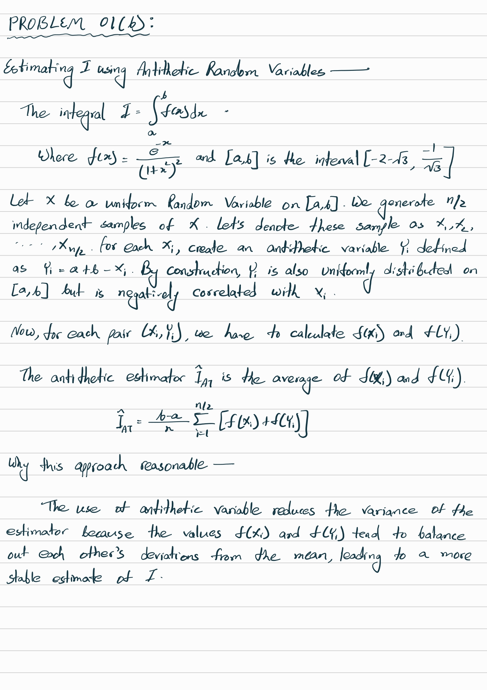
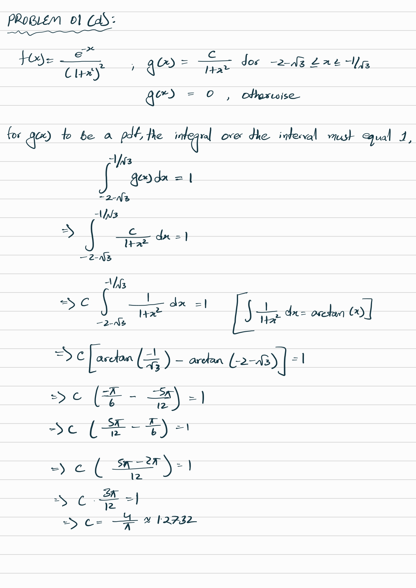
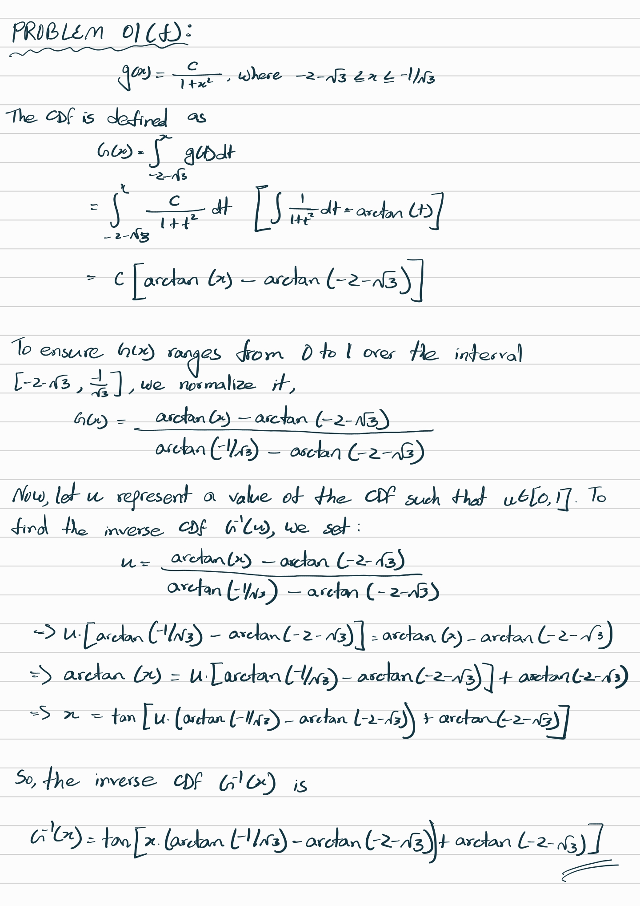
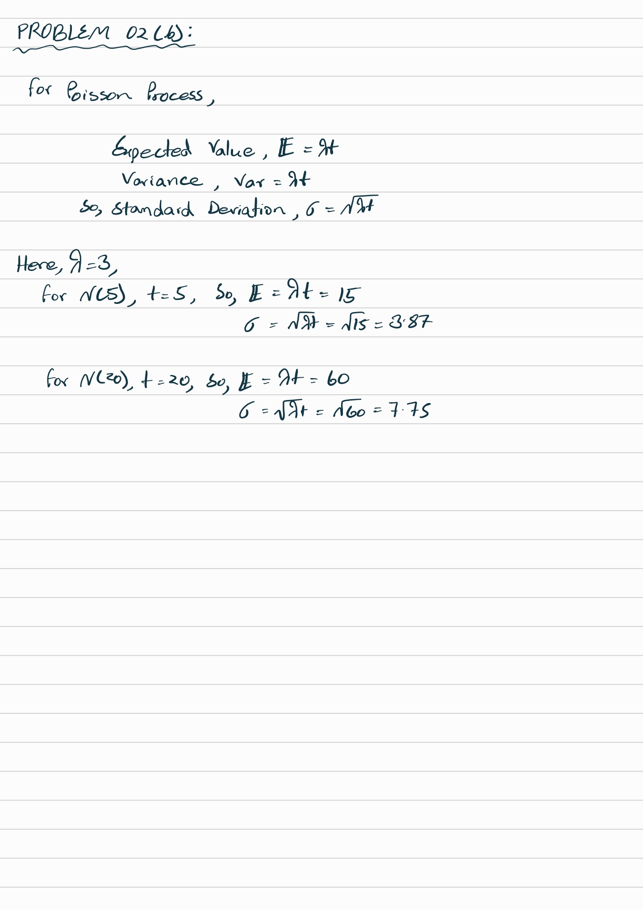
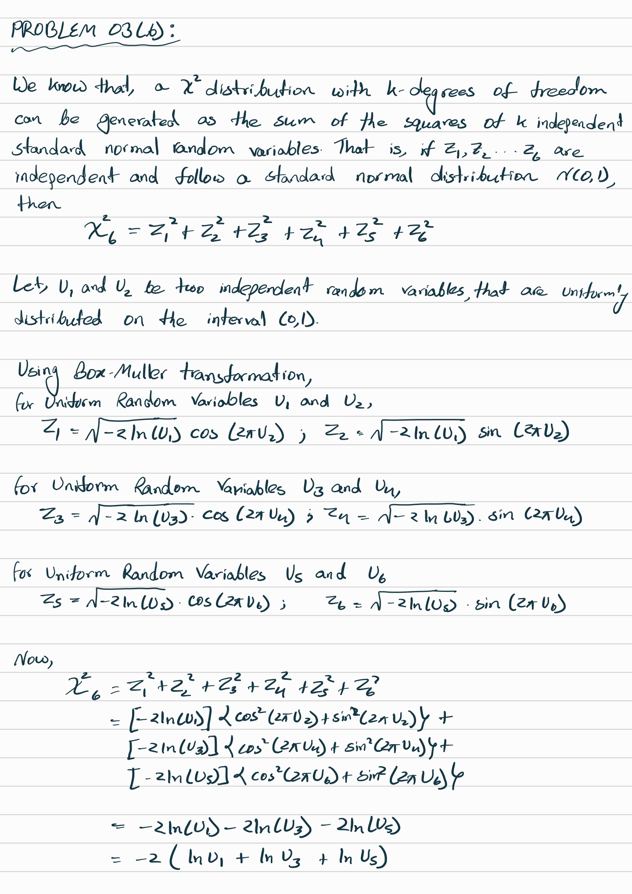

```{r setup, include=FALSE}
rm(list=ls()) # Clear the workspace to start fresh
knitr::opts_chunk$set(echo = TRUE)
library(stats) # Load necessary package
```

### Problem 01 (a) || R
```{r}
# Set seed for reproducibility
set.seed(123)

# Number of simulations
n <- 10000

# Define the limits of the integral
a <- -2 - sqrt(3)
b <- -1 / sqrt(3)

# Define the function f(x)
f <- function(x) {
  exp(-x) / (1 + x^2)^2
}

# Generate n uniformly distributed random variables in the interval [a, b]
x <- runif(n, min = a, max = b)

# Calculate the crude Monte Carlo estimate
I_CMC <- (b - a) * mean(f(x))

# Print the result
cat("Estimated value of I using Crude Monte Carlo:", I_CMC)
```

### Problem 01 (b) || R
```{r}
# Define the function f(x)
f <- function(x) {
  exp(-x) / (1 + x^2)^2
}

# Define the interval for plotting
x_values <- seq(-5, 5, length.out = 1000)

# Evaluate the function at each x value
f_values <- f(x_values)

# Plot the function f(x) over the interval [-5, 5]
plot(x_values, f_values, type = "l", col = "blue", lwd = 2,
     xlab = "x", ylab = "f(x)",
     main = expression(paste("Plot of ", f(x), " = e^(-x) / (1 + x^2)^2")),
     xlim = c(-5, 5))
```

\newpage
### Problem 01 (b) || Theory

\newpage

### Problem 01 (c) || R
```{r}
# Number of simulations
n <- 10000  # Total number of simulations
n_half <- n / 2  # Half of the simulations for generating antithetic pairs

# Define the limits of the integral
a <- -2 - sqrt(3)
b <- -1 / sqrt(3)

# Define the function f(x)
f <- function(x) {
  exp(-x) / (1 + x^2)^2
}

# Generate n/2 uniformly distributed random variables in the interval [a, b]
X <- runif(n_half, min = a, max = b)

# Create antithetic variables
Y <- a + b - X

# Calculate the Monte Carlo estimate using antithetic random variables
I_AT <- (b - a) * mean(f(X) + f(Y)) / 2

# Print the result
cat("Estimated value of I using Antithetic Monte Carlo:", I_AT)
```

\newpage
### Problem 01 (d) || Theory

\newpage

### Problem 01 (e) || R
```{r}
# Define the function f(x)
f <- function(x) {
  exp(-x) / (1 + x^2)^2
}

# Calculate the constant c for g(x)
# Define the limits of the interval
lower_limit <- -2 - sqrt(3)
upper_limit <- -1 / sqrt(3)

# Calculate the integral of 1 / (1 + x^2) over the given interval
integral_value <- atan(upper_limit) - atan(lower_limit)

# Calculate the constant c such that g(x) integrates to 1
c <- 1 / integral_value

# Define the function g(x)
g <- function(x) {
  if (x >= -2 - sqrt(3) && x <= -1 / sqrt(3)) {
    return(c / (1 + x^2))
  } else {
    return(0)
  }
}

# Create a vectorized version of g(x) for plotting
g_vectorized <- Vectorize(g)

# Define the interval for plotting
x_values <- seq(-5, 5, length.out = 1000)

# Evaluate the functions at each x value
f_values <- f(x_values)
g_values <- g_vectorized(x_values)

# Plot f(x) and g(x) on the same graph
plot(x_values, f_values, type = "l", col = "blue", lwd = 2,
     xlab = "x", ylab = "Density",
     main = expression(paste("Plot of ", f(x), " and ", g(x))),
     xlim = c(-5, 5))
lines(x_values, g_values, col = "red", lwd = 2, lty = 2)
legend("topright", legend = c(expression(f(x)), expression(g(x))),
       col = c("blue", "red"), lty = c(1, 2), lwd = 2)

# Print the result
cat("The value of c for g(x) is:", c)

# Assess g(x) as an importance function----------------------------------------------
# The function g(x) approximates f(x) in the interval where g(x) is non-zero. If g(x)
# captures the general behavior of f(x) in this interval, it can serve as a good 
# importance function. Ideally, g(x) should closely follow the shape of f(x) to be 
# effective.
```

\newpage
### Problem 01 (f) || Theory

\newpage

### Problem 01 (g) || R
```{r}
# Number of simulations
n <- 10000

# Define the limits of the integral
lower_limit <- -2 - sqrt(3)
upper_limit <- -1 / sqrt(3)

# Define the constant c (from previous calculations)
c <- 1.27324

# Define the function f(x)
f <- function(x) {
  exp(-x) / (1 + x^2)^2
}

# Define the density function g(x)
g <- function(x) {
  if (x >= lower_limit && x <= upper_limit) {
    return(c / (1 + x^2))
  } else {
    return(0)
  }
}

# Create a vectorized version of g(x) for calculation
g_vectorized <- Vectorize(g)

# Define the inverse CDF function G^-1(u) for sampling from g(x)
G_inverse <- function(u) {
  tan(u * (atan(upper_limit) - atan(lower_limit)) + atan(lower_limit))
}

# Generate random samples from g(x) using inverse transform sampling
u_samples <- runif(n)
x_samples <- G_inverse(u_samples)

# Calculate the importance sampling estimator
weights <- f(x_samples) / g_vectorized(x_samples)
I_IM <- mean(weights)

# Print the result
cat("Estimated value of I using Importance Sampling:", I_IM)
```

### Problem 01 (h) || R
```{r}
# Number of replications
num_replications <- 1000
n <- 10000  # Number of samples for each estimate

# Define the limits of the integral
lower_limit <- -2 - sqrt(3)
upper_limit <- -1 / sqrt(3)

# Define the constant c (from previous calculations)
c <- 1.27324

# Define the function f(x)
f <- function(x) {
  exp(-x) / (1 + x^2)^2
}

# Define the density function g(x)
g <- function(x) {
  if (x >= lower_limit && x <= upper_limit) {
    return(c / (1 + x^2))
  } else {
    return(0)
  }
}

# Vectorize the density function g(x) for calculation
g_vectorized <- Vectorize(g)

# Define the inverse CDF function G^-1(u) for sampling from g(x)
G_inverse <- function(u) {
  tan(u * (atan(upper_limit) - atan(lower_limit)) + atan(lower_limit))
}

# Function to calculate the Crude Monte Carlo estimate
estimate_CMC <- function() {
  x <- runif(n, min = lower_limit, max = upper_limit)
  (upper_limit - lower_limit) * mean(f(x))
}

# Function to calculate the Antithetic estimate
estimate_AT <- function() {
  x <- runif(n / 2, min = lower_limit, max = upper_limit)
  y <- lower_limit + upper_limit - x
  (upper_limit - lower_limit) * mean((f(x) + f(y)) / 2)
}

# Function to calculate the Importance Sampling estimate
estimate_IM <- function() {
  u_samples <- runif(n)
  x_samples <- G_inverse(u_samples)
  weights <- f(x_samples) / g_vectorized(x_samples)
  mean(weights)
}

# Generate 1,000 replications of each estimator
estimates_CMC <- replicate(num_replications, estimate_CMC())
estimates_AT <- replicate(num_replications, estimate_AT())
estimates_IM <- replicate(num_replications, estimate_IM())

# Calculate the mean and standard deviation for each set of estimates
mean_CMC <- mean(estimates_CMC)
sd_CMC <- sd(estimates_CMC)

mean_AT <- mean(estimates_AT)
sd_AT <- sd(estimates_AT)

mean_IM <- mean(estimates_IM)
sd_IM <- sd(estimates_IM)

# Print the results
cat("Results of 1,000 Replications:\n")
cat("Crude Monte Carlo Estimator || 
    Mean:", mean_CMC, "  Standard Deviation:", sd_CMC, "\n")
cat("Antithetic Estimator || 
    Mean:", mean_AT, "  Standard Deviation:", sd_AT, "\n")
cat("Importance Sampling Estimator || 
    Mean:", mean_IM, "  Standard Deviation:", sd_IM, "\n")

# Compare and Comment
# 
# Mean Estimates: 
# All three estimators provide mean estimates that are very close to each other, 
# suggesting that all methods are accurately estimating I. This consistency across 
# methods validates the implementation and the effectiveness of each technique.
# 
# Standard Deviation (Variability):
# 01. Crude Monte Carlo has the highest standard deviation (0.0068), which is 
# expected since it does not incorporate any variance reduction techniques.
# 02. Antithetic Sampling reduces the standard deviation to 0.00415 by using 
# negatively correlated random variables, thus lowering variability and 
# increasing precision.
# 03. Importance Sampling achieves the lowest standard deviation (0.00222) due to
# the choice of g(x) that approximates f(x). This targeted sampling approach 
# significantly reduces the estimator’s variability.
# 
# 
# 
# The reduction in standard deviation indicates that both Antithetic Sampling 
# and Importance Sampling are more efficient than the Crude Monte Carlo method. 
# Among these, Importance Sampling is the most efficient due to its smallest 
# standard deviation.
```

### Problem 01 (i) || R
```{r}
# Standard deviation of the Crude Monte Carlo estimator (from previous results)
sigma_CMC <- 0.006840798

# Set the desired margin of error and confidence level
margin_of_error <- 0.001
z_value <- qnorm(0.995)  # z-value for 99% confidence level (0.5% on each tail)

# Calculate the required number of simulations
n_required <- (z_value * sigma_CMC / margin_of_error)^2

# Print the result
cat("Number of simulations required for 99% confidence and a margin of 0.001:", 
    ceiling(n_required), "\n")
```

\newpage
### Problem 02 (a) || R
```{r}
# Define the intensity (lambda) and the time interval
lambda <- 3
time_interval <- 30

# Generate interarrival times from an exponential distribution
interarrival_times <- rexp(1000, rate = lambda)

# Calculate the cumulative sum of interarrival times to get event times
event_times <- cumsum(interarrival_times)

# Filter event times to be within the interval [0, 30]
event_times <- event_times[event_times <= time_interval]

# Count the number of events over time to plot N(t)
N_t <- 1:length(event_times)

# Plot the Poisson process N(t)
plot(event_times, N_t, type = "s", col = "blue", lwd = 2,
     xlab = "Time", ylab = "Number of Events",
     main = expression(paste("Poisson Process N(t) with ", lambda, " = 3")))

# Print Result
cat("Number of events in [0, 30]:", length(event_times), "\n")
```

\newpage
### Problem 02 (b) || Theory

\newpage

### Problem 02 (c) || R
```{r}
# Define the intensity (lambda) and the time interval
lambda <- 3
time_interval <- 30
num_realizations <- 40

# Create a plot with a fixed range
plot(0, 0, type = "n", xlim = c(0, time_interval), ylim = c(0, 100),
     xlab = "Time", ylab = "Number of Events",
     main = paste(num_realizations, "Realizations of Poisson Process with", 
                  expression(lambda), "= 3"))

# Generate and plot each realization
for (i in 1:num_realizations) {
  # Generate interarrival times for one realization
  interarrival_times <- rexp(1000, rate = lambda)
  event_times <- cumsum(interarrival_times)
  
  # Filter event times to be within the interval [0, 30]
  event_times <- event_times[event_times <= time_interval]
  N_t <- 1:length(event_times)
  
  # Plot the realization as a step function
  lines(event_times, N_t, type = "s", col = rgb(0, 0, 1, alpha = 0.3))
}

# Adding a legend
legend("topleft", legend = "Poisson Process Realizations", 
       col = rgb(0, 0, 1, alpha = 0.3), lwd = 1, bty = "n")


# Comment on Pattern
# The realizations exhibits variability around the expected number of events calculated 
# in Problem 2b.
# At t=5, the expected number of events is 15, with a standard deviation of 3.87.
# At t=20, the expected number of events is 60, with a standard deviation of 7.75.
# 
# 
# In the plot, we can see that the number of events at any time t tends to fluctuate 
# around these expected values. The step functions illustrate the random nature of event
# occurrences in a Poisson process. The density of events increases over time due to the 
# constant intensity lambda, reflecting the increasing number of events as time progresses.
```

### Problem 02 (d) || R
```{r}
# Define the intensity (lambda) and the number of simulations
lambda <- 3
num_simulations <- 10000  # Number of simulations

### (i) Probability of Observing at Least 80 Events in [0, 30]

# Define the time interval for part (i)
time_interval_30 <- 30

# Simulate the number of events in each realization for the interval [0, 30]
event_counts_30 <- replicate(num_simulations, {
  # Generate interarrival times and calculate cumulative sum for each realization
  interarrival_times <- rexp(1000, rate = lambda)
  event_times <- cumsum(interarrival_times)
  
  # Count the number of events within the interval [0, 30]
  sum(event_times <= time_interval_30)
})

# Calculate the probability of observing at least 80 events in [0, 30]
probability_at_least_80 <- mean(event_counts_30 >= 80)

# Print the result
cat("Estimated probability of observing at least 80 events in [0, 30]:", 
    probability_at_least_80, "\n")

### (ii) Probability of Observing Less Than 30 Events in [0, 10]

# Define the time interval for part (ii)
time_interval_10 <- 10

# Simulate the number of events in each realization for the interval [0, 10]
event_counts_10 <- replicate(num_simulations, {
  # Generate interarrival times and calculate cumulative sum for each realization
  interarrival_times <- rexp(1000, rate = lambda)
  event_times <- cumsum(interarrival_times)
  
  # Count the number of events within the interval [0, 10]
  sum(event_times <= time_interval_10)
})

# Calculate the probability of observing less than 30 events in [0, 10]
probability_less_than_30 <- mean(event_counts_10 < 30)

# Print the result
cat("Estimated probability of observing less than 30 events in [0, 10]:", 
    probability_less_than_30, "\n")
```

### Problem 02 (e) || R
```{r}
# Define the parameters for the truncated normal distribution
a <- 8
b <- 17.5
mu <- 12.5
sigma <- 1

# Define the truncated normal pdf function
f_truncated <- function(t, mu, sigma, a, b) {
  # Calculate the normal pdf and CDF values
  numerator <- dnorm((t - mu) / sigma) / sigma
  denominator <- pnorm((b - mu) / sigma) - pnorm((a - mu) / sigma)
  
  # Compute the pdf of the truncated normal distribution
  if (t >= a && t <= b) {
    return(numerator / denominator)
  } else {
    return(0)
  }
}

# Define the intensity function lambda(t)
lambda <- function(t) {
  100 * sapply(t, f_truncated, mu = mu, sigma = sigma, a = a, b = b)
}

# Define the interval for the process
t_min <- 7
t_max <- 18

# Define the interval for plotting lambda(t)
t_values <- seq(t_min, t_max, length.out = 1000)

# Evaluate the intensity function lambda(t) over the interval
lambda_values <- lambda(t_values)

# Plot the intensity function lambda(t)
plot(t_values, lambda_values, type = "l", col = "blue", lwd = 2,
     xlab = "Time (t)", ylab = expression(lambda(t)),
     main = expression(paste("Intensity Function ", lambda(t), " over [7, 18]")))
```

### Problem 02 (f) || R
```{r}
# Define the parameters for the truncated normal distribution
a <- 8
b <- 17.5
mu <- 12.5
sigma <- 1

# Define the truncated normal pdf function (same as Problem 2e)
f_truncated <- function(t, mu, sigma, a, b) {
  numerator <- dnorm((t - mu) / sigma) / sigma
  denominator <- pnorm((b - mu) / sigma) - pnorm((a - mu) / sigma)
  
  if (t >= a && t <= b) {
    return(numerator / denominator)
  } else {
    return(0)
  }
}

# Define the intensity function lambda(t) (same as Problem 2e)
lambda <- function(t) {
  100 * sapply(t, f_truncated, mu = mu, sigma = sigma, a = a, b = b)
}

# Define the interval for the process
t_min <- 7
t_max <- 18

# Find the maximum value of lambda(t) over the interval [7, 18]
t_values <- seq(t_min, t_max, length.out = 1000)
lambda_max <- max(lambda(t_values))

# Simulate a homogeneous Poisson process with intensity lambda_max
candidate_times <- cumsum(rexp(10000, rate = lambda_max))
candidate_times <- 
  candidate_times[candidate_times <= t_max & candidate_times >= t_min]

# Apply the thinning algorithm to select events based on lambda(t) / lambda_max
accepted_times <- 
  candidate_times[runif(length(candidate_times)) <= 
                    lambda(candidate_times) / lambda_max]

# Plot the non-homogeneous Poisson process
plot(accepted_times, 1:length(accepted_times), type = "s", col = "red", lwd = 2,
     xlab = "Time (t)", ylab = "Number of Events",
     main = 
       expression(paste("Non-Homogeneous Poisson Process with ", lambda(t))))
```

### Problem 02 (g) || R
```{r}
# Define the parameters for the truncated normal distribution
a <- 8
b <- 17.5
mu <- 12.5
sigma <- 1

# Define the truncated normal pdf function (same as Problem 2e)
f_truncated <- function(t, mu, sigma, a, b) {
  numerator <- dnorm((t - mu) / sigma) / sigma
  denominator <- pnorm((b - mu) / sigma) - pnorm((a - mu) / sigma)
  
  if (t >= a && t <= b) {
    return(numerator / denominator)
  } else {
    return(0)
  }
}

# Define the intensity function lambda(t) (same as Problem 2e)
lambda <- function(t) {
  100 * sapply(t, f_truncated, mu = mu, sigma = sigma, a = a, b = b)
}

# Define the interval for the process
t_min <- 7
t_max <- 18

# Find the maximum value of lambda(t) over the interval [7, 18]
t_values <- seq(t_min, t_max, length.out = 1000)
lambda_max <- max(lambda(t_values))

# Function to generate a single replication of non-homogeneous Poisson process
generate_process <- function() {
  # Generate candidate event times using homogeneous Poisson process with lambda_max
  candidate_times <- cumsum(rexp(1000, rate = lambda_max))
  candidate_times <- 
    candidate_times[candidate_times <= t_max & candidate_times >= t_min]
  
  # Apply the thinning algorithm to select events based on lambda(t) / lambda_max
  accepted_times <- candidate_times[runif(length(candidate_times)) <= 
                                      lambda(candidate_times) / lambda_max]
  return(accepted_times)
}

# Number of replications
num_replications <- 10000

# Simulate 10,000 replications and count arrivals in the specified intervals
arrivals_before_10 <- numeric(num_replications)
arrivals_11_to_13 <- numeric(num_replications)

for (i in 1:num_replications) {
  # Generate a single replication of the process
  event_times <- generate_process()
  
  # Count the number of arrivals before 10:00
  arrivals_before_10[i] <- sum(event_times < 10)
  
  # Count the number of arrivals between 11:00 and 13:00
  arrivals_11_to_13[i] <- sum(event_times >= 11 & event_times <= 13)
}

# Calculate the average number of arrivals for each interval
average_before_10 <- mean(arrivals_before_10)
average_11_to_13 <- mean(arrivals_11_to_13)

# Print the results
cat("Average number of arrivals before 10:00:", average_before_10, "\n")
cat("Average number of arrivals between 11:00 and 13:00:", average_11_to_13, "\n")
```

\newpage
### Problem 03 (a) || R
```{r}
# Number of Monte Carlo samples
n <- 5000

# Define the limits of the integration
x_lower <- 1
x_upper <- 4
y_lower <- -2
y_upper <- 2
z_lower <- 0
z_upper <- 1
w_lower <- 0
w_upper <- 10

# Sampling uniformly for x, y, z, and exponentially for w
x_samples <- runif(n, min = x_lower, max = x_upper)
y_samples <- runif(n, min = y_lower, max = y_upper)
z_samples <- runif(n, min = z_lower, max = z_upper)
w_samples <- rexp(n, rate = 4)  # Exponential distribution with rate = 4

# Define the integrand function
integrand <- function(x, y, z, w) {
  (1 / (1 + x^2 + y^2 + z^2)) * exp(-w / 4)
}

# Calculate the value of the integrand at the sampled points
integrand_values <- integrand(x_samples, y_samples, z_samples, w_samples)

# Calculate the volume of the integration region
volume <- 
  (x_upper - x_lower) * (y_upper - y_lower) * (z_upper - z_lower) * w_upper

# Estimate the integral using Monte Carlo
integral_estimate <- volume * mean(integrand_values)

# Print the result
cat("Estimated value of the nested integral using Monte Carlo integration:", 
    integral_estimate, "\n")
```

\newpage
### Problem 03 (b) || Theory

\newpage

### Problem 04 (a) || R
```{r}
# Install and load the "shapes" package if not already installed
if (!require(shapes)) {
  install.packages("shapes")
  library(shapes)
}

# Load the female data
load("C:/Users/USER/Documents/panf.dat.rda")
female_data <- get("panf.dat")

# Load the male data
load("C:/Users/USER/Documents/panm.dat.rda")
male_data <- get("panm.dat")

# Plot the data for female and male chimpanzees using plotshapes
par(mfrow = c(1, 2))
plotshapes(female_data)
title("Female Chimpanzee Skull")

plotshapes(male_data)
title("Male Chimpanzee Skull")
```

### Problem 04 (b) || R
```{r}
# Calculate the centroid size for female chimpanzees
female_centroid_sizes <- apply(female_data, 3, centroid.size)
mean_female_centroid <- mean(female_centroid_sizes)

# Calculate the centroid size for male chimpanzees
male_centroid_sizes <- apply(male_data, 3, centroid.size)
mean_male_centroid <- mean(male_centroid_sizes)

# Print the mean centroid sizes
cat("Mean Centroid Size for Female Chimpanzees:", mean_female_centroid, 
    "and Male Chimpanzees:", mean_male_centroid)

# Perform bootstrap sampling with B = 5,000
B <- 5000

# Bootstrap mean centroid size for female chimpanzees
bootstrap_female <- replicate(B, {
  resample_indices <- sample(1:length(female_centroid_sizes), replace = TRUE)
  mean(female_centroid_sizes[resample_indices])
})

# Bootstrap mean centroid size for male chimpanzees
bootstrap_male <- replicate(B, {
  resample_indices <- sample(1:length(male_centroid_sizes), replace = TRUE)
  mean(male_centroid_sizes[resample_indices])
})

# Print the bootstrap estimates for the means
cat("Bootstrap Mean for Female Chimpanzees:", mean(bootstrap_female), 
    "and Male Chimpanzees:", mean(bootstrap_male))

# Plot the bootstrap distributions
par(mfrow = c(1, 2))
hist(bootstrap_female, 
     main = "Bootstrap Distribution - Female", xlab = "Mean Centroid Size")
hist(bootstrap_male, 
     main = "Bootstrap Distribution - Male", xlab = "Mean Centroid Size")
```

### Problem 04 (c) || R
```{r}
# Calculate the 95% percentile bootstrap confidence intervals
ci_female <- quantile(bootstrap_female, probs = c(0.025, 0.975))
ci_male <- quantile(bootstrap_male, probs = c(0.025, 0.975))

# Print the confidence intervals
cat("95% Percentile Bootstrap Confidence Interval for Female Mean Centroid Size:", ci_female)
cat("95% Percentile Bootstrap Confidence Interval for Male Mean Centroid Size:", ci_male)

# Interpretation of the Results
if (ci_female[2] < ci_male[1] || ci_male[2] < ci_female[1]) {
  cat("The confidence intervals for female and male mean centroid sizes do not overlap, 
      suggesting a significant difference in skull size between female and male chimpanzees.")
} else {
  cat("The confidence intervals for female and male mean centroid sizes overlap, suggesting 
      no clear significant difference in skull size between female and male chimpanzees.")
}
```
